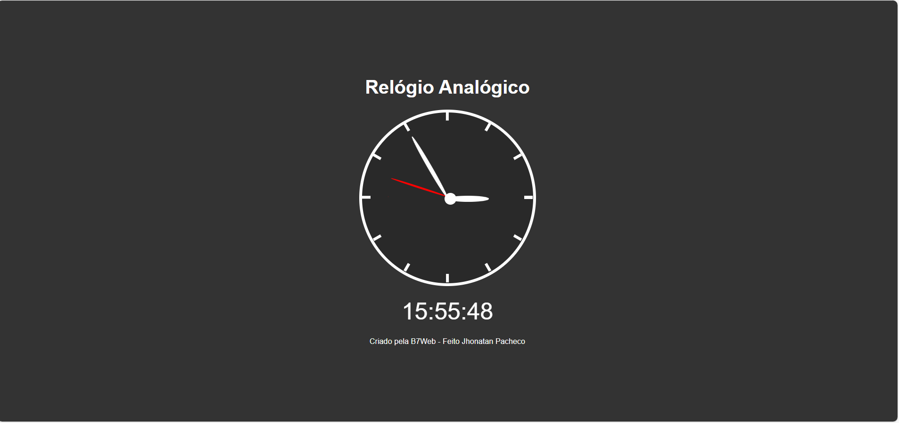

<h1 align="center"> Projeto Clock Base - Aplicação web relogio digital e analogico. </h1>

Projeto desenvolvido para demostração dos meus projetos pessoais portfolio.  

  <a href="#-tecnologias">Tecnologias</a>&nbsp;&nbsp;&nbsp;|&nbsp;&nbsp;&nbsp;
  <a href="#-projeto">Projeto</a>&nbsp;&nbsp;&nbsp;|&nbsp;&nbsp;&nbsp;
  <a href="#-layout">Layout</a>&nbsp;&nbsp;&nbsp;|&nbsp;&nbsp;&nbsp;
  <a href="#memo-licença">Licença</a>

  

 

  

 

## 🚀 Tecnologias

Esse projeto foi desenvolvido com as seguintes tecnologias:

- HTML e CSS
- JavaScript
- Git e Github

## 💻 Projeto

Projeto desenvolvido para uso pessoal de portfolio

- [Acesse o projeto finalizado, online](https://#)

- [Assistir aulas](https://#)

## 🔖 Layout

Você pode visualizar o layout do projeto através [DESSE LINK](<https://www.figma.com/file/5T5CaHRWHZqDN1DKTEvJ3o/C%C3%A1psula-do-tempo-%E2%80%A2-Trilha-Ignite-(Community)?type=design&node-id=28%3A2&mode=design&t=70rpjyIEUfqa0vVd-1>). É necessário ter conta no [Figma](https://figma.com) para acessá-lo.

<!-- ## :memo: Licença -->
